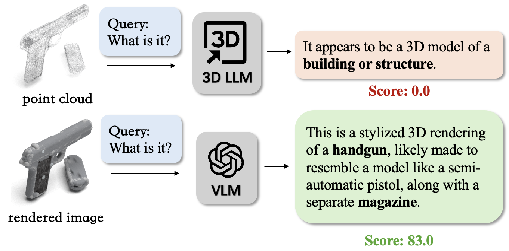
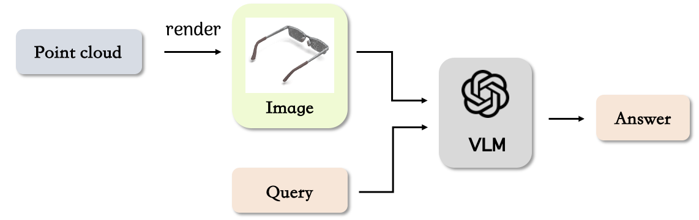
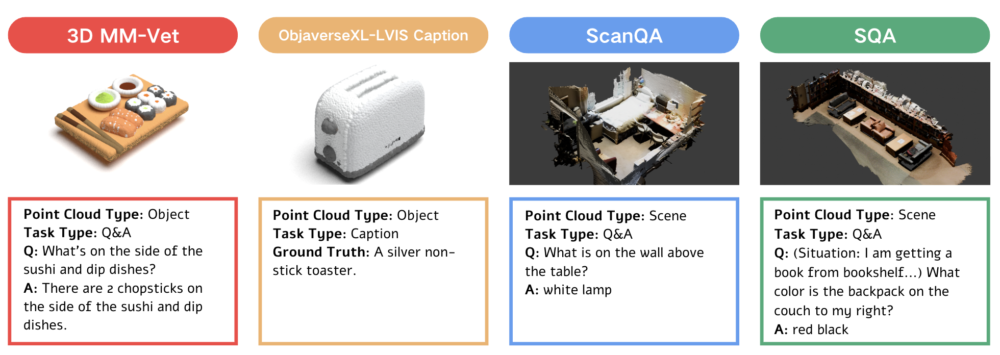
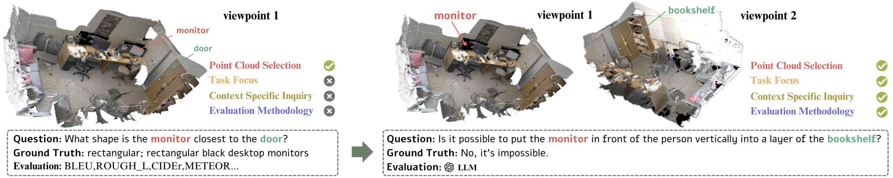

> In Submission.

    

Authors: [Jiahe Jin](https://github.com/zizi0123)\*, [Yanheng He](https://github.com/HenryHe0123)\*, [Mingyan Yang](https://github.com/Fircube)\*

- [Source Code](https://github.com/LLM-class-group/Revisiting-3D-LLM-Benchmarks)

- [Preprint](https://arxiv.org/abs/2502.08503)

### Abstract

In this work, we identify the "2D-Cheating" problem in 3D LLM evaluation, where these tasks might be easily solved by VLMs with rendered images of point clouds, exposing ineffective evaluation of 3D LLMs' unique 3D capabilities. We test VLM performance across multiple 3D LLM benchmarks and, using this as a reference, propose principles for better assessing genuine 3D understanding. We also advocate explicitly separating 3D abilities from 1D or 2D aspects when evaluating 3D LLMs.

### VLM3D

    

We propose **VLM3D**, a simple yet general pipeline that adapts VLMs to 3D tasks. Specifically, it first renders point clouds into images and augments queries with few-shot, then feeds them into a VLM.

### Experiments

We conducted experiments on the above benchmarks, which cover major benchmarks commonly used for evaluating 3D LLMs, including those proposed by the model creators and those widely adopted across 3D LLM evaluations. 

### Principles

Based on our experiments and analysis, we propose four principles for effective 3D capabilities evaluation of 3D LLMs. We applied these principles to redesign a task, as shown above.

### Acknowledgement

We would like to express our sincere gratitude to Prof. Yonglu Li for his valuable guidance and support throughout this research, from topic selection to the final writing. His insightful discussions and feedback have been essential to the completion of this work. We would also like to thank Ye Wang for kindly sharing the viewpoint dataset in ScanNet.
